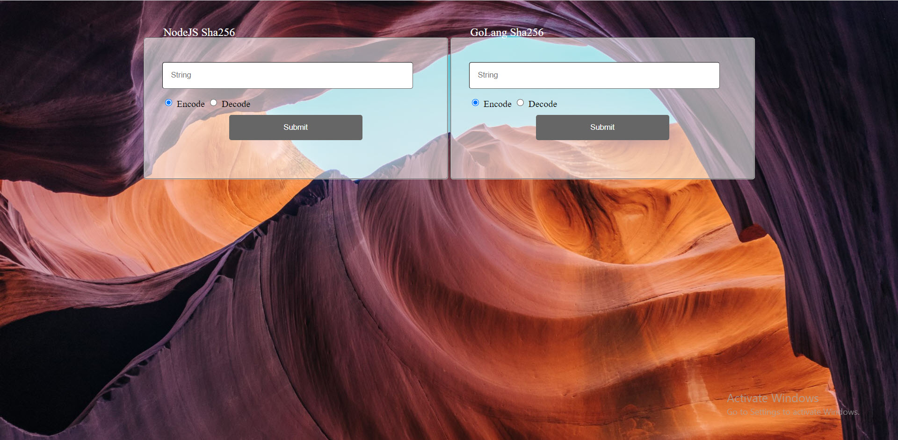

# **HW1 Web Programming**

- Arsalan Firoozi 
- Erfan Nosrati
- Amirhosein Javadi

## **Frontend**
The left box uses NodeJS and the right one uses GoLang to send data. NodeJS uses method Post and GoLang uses method Get. Each box has two radio-button for encoding and decoding.

If user want to get Hash of it's ID, we check lenght of ID and if lenght is smaller than eight, we responde: 'Theres is not enough characters', otherwise we respond it's Hash and save this (ID,Hash) in database.

If user wand to decode it's Hash, we search our database for this response and return it's ID if there is one. 

## **Golang**
In this part, we first check lenght of our query and make appropriate response if it's too short, otherwise we create a query to database. 

We first send Authentication message to database. This message contain include user, dbname and password of database to access it. 

If user asked for ID of its Hash, we seach database with this command:
> db.QueryRow("SELECT \"Key\" FROM public.\"Train\" where \"Hash\" = '" + Input + "'").Scan(&Key)

If we had error, it means that we don't have any data with the given Hash and we will responde "No record found", otherwise we will respond the user's key.

If user wants to Insert its ID and Hash, we first make the Hash of user's ID with sha256 method. Then
